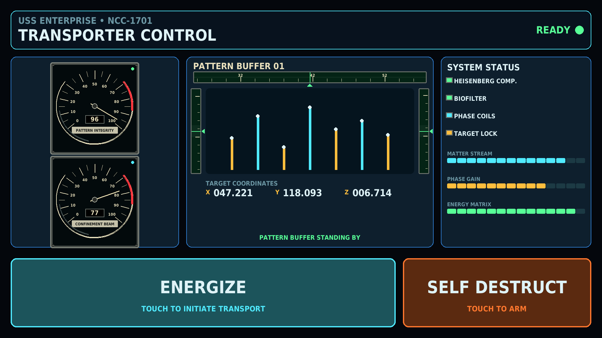

# Raspberry Pi Transporter Console

A full-screen, touch-first sci-fi transporter console built for a Halloween party. It turns a Raspberry Pi, a 1080p touchscreen, and a speaker into an interactive prop with animated gauges, pattern-buffer displays, sound effects, and an intentionally overdramatic self-destruct sequence.



## Features

- Large touchscreen **ENERGIZE** control with animated transporter sequence
- Protected two-touch **SELF DESTRUCT** control
- Spoken ten-second countdown, siren, explosion, and five-press abort sequence
- Animated meters, indicators, energy bars, coordinates, and pattern-buffer display
- 1960s spacecraft styling with analog instruments and Apollo-inspired moving-tape meters
- Status-aware tape illumination: green when ready, amber while active or armed, and red for danger
- Panel-mounted analog meters with hardware bezels, calibration scales, needles, and jewel lamps
- Full-screen 1920×1080 kiosk layout that scales to other resolutions
- Optional physical green and red buttons through Raspberry Pi GPIO
- Keyboard test mode and automatic desktop launch

The touchscreen is the primary interface. Physical arcade buttons are optional.

At idle, the pattern buffer remains stable and the analog needles drift only slightly, like live electrical instruments. Rapid pattern motion is reserved for an active transport sequence.

## Hardware used

- Raspberry Pi running Raspberry Pi OS
- CAPERAVE 15.6-inch, 1920×1080, 10-point capacitive touchscreen
- HDMI video and USB touch connection
- Powered speaker
- Optional normally-open buttons on GPIO 17 and GPIO 27

Other HDMI/USB touchscreens should work because the UI derives its size from the active display.

## Quick start

Install dependencies:

```bash
sudo apt update
sudo apt install python3-pygame python3-rpi.gpio
```

Copy `startrek.py` and your audio files into one directory, then run:

```bash
python3 startrek.py --test
```

Test controls:

- `G` — energize transporter
- `R` — start self-destruct or add one abort press
- `Q` or `Esc` — exit

For the full Raspberry Pi kiosk with GPIO enabled:

```bash
python3 startrek.py --mode=both
```

## Audio files

Audio recordings are not included. Add your own original, licensed, or public-domain WAV files:

```text
transporter.wav
siren.wav
speak_started.wav
speak_10.wav through speak_1.wav
speak_aborted.wav
speak_kaboom.wav
```

Voice uses mixer channel 0 at full volume. The siren loops on channel 1 at 40% so the countdown stays intelligible. The console still runs when sounds are absent.

## Options

```bash
python3 startrek.py --mode=transporter
python3 startrek.py --mode=selfdestruct
python3 startrek.py --mode=both
```

Add `--test` to bypass GPIO. Add `--windowed` for a resizable 1280×720 development window.

## Touch behavior

- **ENERGIZE** starts immediately when ready.
- **SELF DESTRUCT** changes to **CONFIRM**. A second touch within four seconds starts it.
- During the sequence, the same area becomes **ABORT**. Press five times to cancel.
- Touch-generated mouse events are de-duplicated so one tap cannot count twice.

## Optional GPIO buttons

Wire each normally-open button between its GPIO pin and ground. Internal pull-ups are enabled.

| Function | BCM GPIO | Physical pin |
|---|---:|---:|
| Transporter | 17 | 11 |
| Self-destruct / abort | 27 | 13 |
| Ground | — | 6, 9, 14, or another GND |

## Autostart

Edit `startrek.desktop` if your username or path differs, then install it:

```bash
mkdir -p ~/.config/autostart
cp startrek.desktop ~/.config/autostart/
```

The launcher expects `/home/ggorman/startrek.py`. Change both `Exec` and `Path` to install elsewhere.

## Safety and escape hatch

This is a theatrical prop. It does not control real transporters, warp cores, or self-destruct hardware.

Keep SSH available during setup. Press `Q` or `Esc` in test mode, or stop the process remotely when running full-screen.

## License and attribution

The original code is released under the MIT License.

This is an unofficial fan-made project inspired by classic science-fiction control panels. *Star Trek* and related names and marks belong to their respective owners. No affiliation or endorsement is claimed. Audio from the television programs or films is not distributed here.
