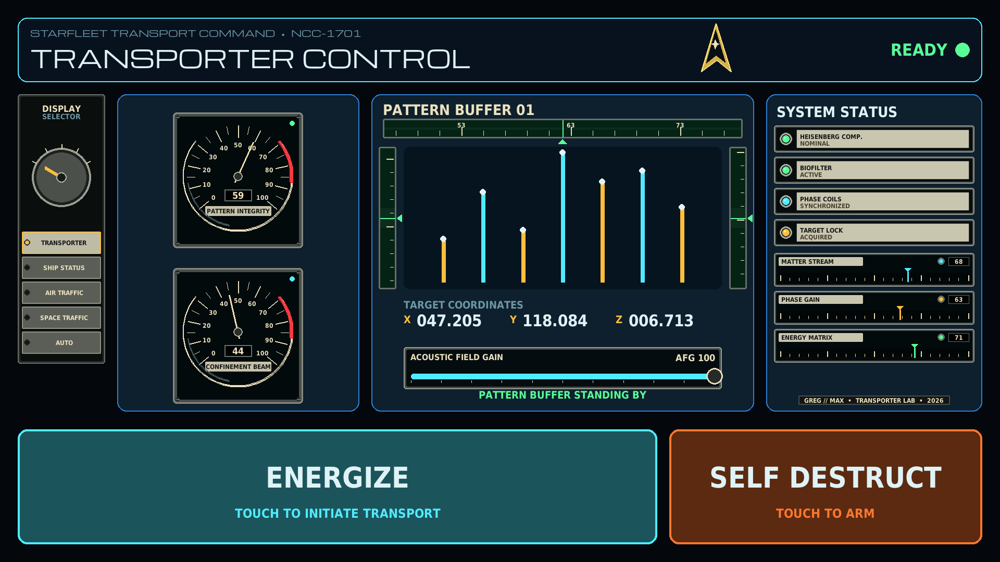
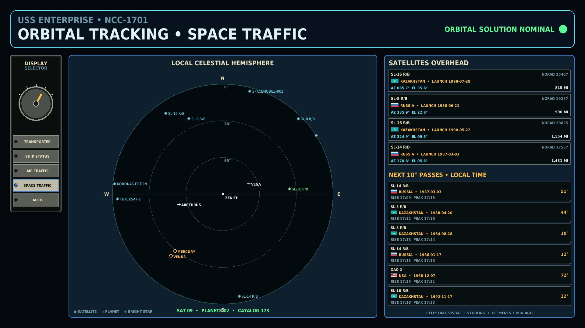
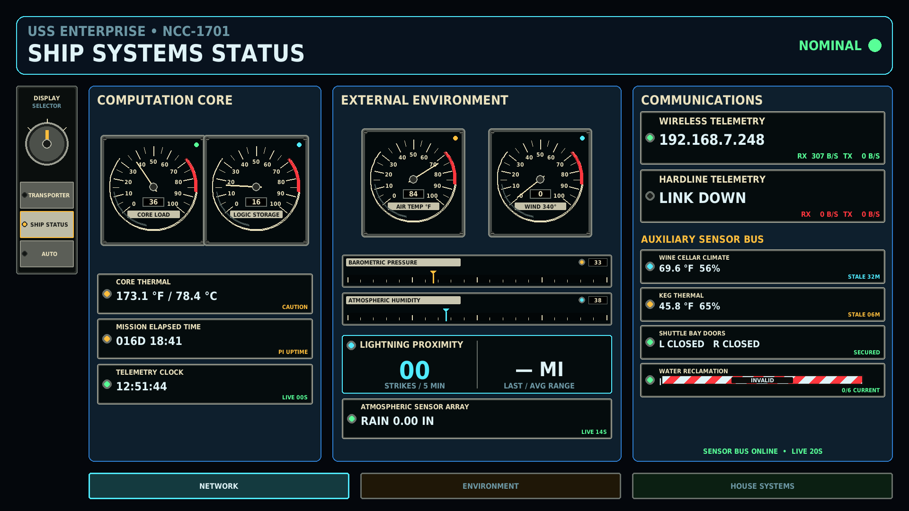
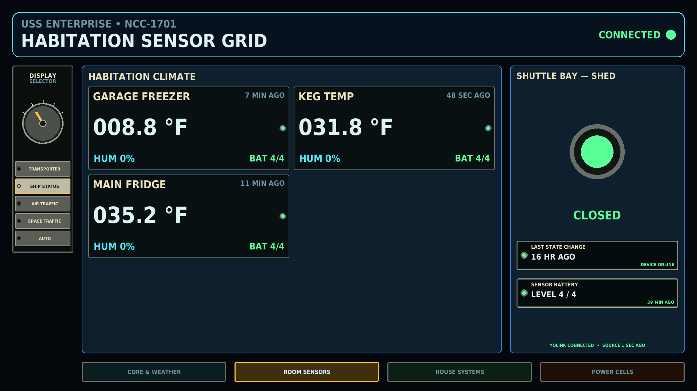
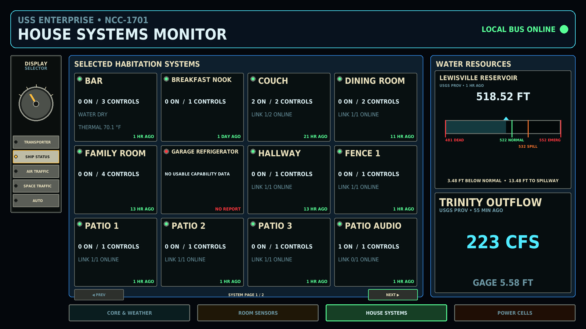

# Raspberry Pi Transporter Console

A full-screen, touch-first sci-fi transporter console built for a Halloween party. It turns a Raspberry Pi, a 1080p touchscreen, and a speaker into an interactive prop with animated gauges, pattern-buffer displays, sound effects, and an intentionally overdramatic self-destruct sequence.

Designed and built by Greg Gorman with Max (OpenAI Codex).





## Features

- Large touchscreen **ENERGIZE** control with animated transporter sequence
- Starfleet-style vector delta and wide sci-fi masthead on the transporter page
- Ten-second synchronized transport cycle with a gentle audio fade at completion
- Protected two-touch **SELF DESTRUCT** control
- Spoken ten-second countdown, siren, explosion, and five-press abort sequence
- Animated meters, indicators, energy bars, coordinates, and pattern-buffer display
- 1960s spacecraft styling with analog instruments and Apollo-inspired moving-tape meters
- Status-aware tape illumination: green when ready, amber while active or armed, and red for danger
- Panel-mounted analog meters with hardware bezels, calibration scales, needles, and jewel lamps
- Bezel-mounted status annunciators with engraved labels and state legends
- Slowly wandering idle instruments and retro edgewise meters instead of modern progress bars
- Broad analog idle sweeps below the red sector, rising toward caution during transport
- Broad, asynchronous tape movement at idle that stabilizes with fast regulator corrections during transport
- Coordinated acquisition, confinement, dematerialization, transfer, and rematerialization phases
- Slowly searching target coordinates that lock solid throughout transport
- Five-second monochrome Sad Mac crash gag after an unaborted core breach
- Animated mushroom-cloud blast synchronized to the spoken kaboom
- Original two-tone retro computer bonk as the Sad Mac appears
- Low-frequency core-breach impact layered beneath the spoken kaboom
- Full-screen pulsing red self-destruct numerals with persistent abort guidance
- Illuminated countdown-screen ABORT control aligned exactly with its live touch target
- **ACOUSTIC FIELD GAIN** touchscreen slider controlling the real PipeWire output from 0–100%
- Persistent five-position **TRANSPORTER / SHIP STATUS / AIR TRAFFIC / SPACE TRAFFIC / AUTO** selector
- Apollo-style Ship Status dashboard with Pi, network, WeatherFlow UDP, and curated MQTT telemetry
- Clear **CORE & WEATHER** and **ROOM SENSORS** ship-status pages
- Paginated House Systems page with selected SmartThings groups and Lewisville water data
- Local PiAware air-traffic radar with flight strips and optional NEXRAD overlay
- CelesTrak orbital plot with touch-selectable overhead objects, paged/pinnable flight strips,
  predicted passes, launch metadata, flags, planets, and bright stars
- Full-screen 1920×1080 kiosk layout that scales to other resolutions
- Optional physical green and red buttons through Raspberry Pi GPIO
- Keyboard test mode and automatic desktop launch

The touchscreen is the primary interface. Physical arcade buttons are optional.

The center-panel **ACOUSTIC FIELD GAIN** control shows `AFG 000` through
`AFG 100`; at zero it reads `AURAL FIELD MUTED`. It controls PipeWire's current
default audio sink with `wpctl`, caps gain at 100%, and relies on WirePlumber's
enabled state restoration to retain the selected level across application and
Raspberry Pi restarts.

At idle, the pattern buffer remains stable and the analog needles drift only slightly, like live electrical instruments. Rapid pattern motion is reserved for an active transport sequence.

## Hardware used

- Raspberry Pi running Raspberry Pi OS
- CAPERAVE 15.6-inch, 1920×1080, 10-point capacitive touchscreen
- HDMI video and USB touch connection
- Powered speaker
- Optional normally-open buttons on GPIO 17 and GPIO 27

Other HDMI/USB touchscreens should work because the UI derives its size from the active display.

## Quick start

Install dependencies:

```bash
sudo apt update
sudo apt install python3-pygame python3-rpi.gpio python3-psutil python3-paho-mqtt python3-skyfield
```

The volume control also requires `wpctl`, supplied by the Raspberry Pi OS
`wireplumber` package.

Install `office_telemetry.py`, `yolink_telemetry.py`, `flight_telemetry.py`, and
`satellite_telemetry.py`
beside `startrek.py`. Ship Status reads Pi health,
`wlan0` and `eth0`, WeatherFlow UDP broadcasts on port 50222, selected MQTT
topics from `snoop433.local:1883`, and the configured Tempest cloud observation.
It does not publish MQTT messages or control any device.

The five-position display selector provides `TRANSPORTER`, `SHIP STATUS`,
`AIR TRAFFIC`, `SPACE TRAFFIC`, and `AUTO` as top-level modes. Ship Status is
subdivided into `CORE & WEATHER`, `ROOM SENSORS`, `HOUSE SYSTEMS`, and
`POWER CELLS`. Space Traffic downloads CelesTrak's public visual and space-
station TLE groups, caches them in `~/.cache/startrek-console`, and refreshes
them no more frequently than every two hours. No Space-Track credentials are
required for this view. Skyfield also caches the JPL DE421 planetary ephemeris
and plots locally visible planets plus the three brightest currently visible
stars from the console's small named bright-star catalog.

Tempest's extended cloud observation supplies the service-reported
midnight-to-midnight `LOCAL DAY ACCUM` value and RainCheck/Nearcast selection.
Copy `startrek-tempest.example.json` privately to
`~/.config/startrek-tempest.json`, protect it with mode `0600`, and add the
personal access token plus station/device IDs. The token is never logged or
stored in the repository. Local UDP remains the immediate source for rain rate,
precipitation type, wind, lightning, and other live weather fields.

The WeatherFlow panel includes a rolling five-minute lightning count built from
the station's one-minute `obs_st` intervals, plus the last or recent average
strike distance in miles. `evt_strike` updates distance immediately without
also incrementing the observation count, preventing duplicate strikes.
Any strike within 0.5 mile records a dedicated close-strike event and deploys
an amber warning cover for 30 minutes showing its distance and elapsed time.

The enlarged precipitation module uses an edgewise tape for rain rate in inches/hour,
four bezel lamps for DRY/RAIN/HAIL/MIX, and a large four-digit seven-segment
`LOCAL DAY ACCUM` display. Network cards likewise use separate logarithmic RX/TX bit-rate dials so
quiet traffic and bursts both remain visible. The service-provided rain value resets at local midnight; `TRACE` is shown
for a nonzero amount that would otherwise round to `0.00 IN`.

Barometric pressure is presented as a ruled-paper pen recorder. It retains a
rolling half-hour trace in memory, automatically magnifies small pressure
changes, and identifies the recent tendency as `RISING`, `FALLING`, or `STEADY`.

Stale or invalid instrument inputs deploy a red-and-white striped `INVALID`
shutter across the affected dial, edge meter, or readout. Valid caution and
alarm states remain visible normally; the shutter indicates missing telemetry,
not merely an unfavorable measurement.

The `POWER CELLS` page automatically inventories every selected SmartThings
device with a battery capability, all supported YoLink sensors, and the Tempest
station battery voltage. It sorts critical and low cells first, distinguishes
old/offline reports from genuinely low readings, and shows both battery-report
age and overall device-activity age.

### SmartThings status

The preferred SmartThings source is the official read-only REST API. Copy the
private configuration template on the Pi:

```bash
install -m 600 startrek-smartthings.example.json ~/.config/startrek-smartthings.json
```

The unattended console uses a read-only SmartThings OAuth installation with
device and location read scopes. Put the private client, access, and refresh
credentials in that file and change `enabled` to `true`. The telemetry service
refreshes the access token an hour before expiry and atomically persists both
new tokens with mode `0600`; SmartThings refresh tokens rotate and must never be
reused. Do not commit this private file or paste its credentials into logs or
issue reports. A temporary Personal Access Token may still be placed in the
legacy `token` field for short discovery sessions, but PATs expire and are not
suitable for the kiosk.

To verify names and capabilities without printing the token:

```bash
python3 smartthings_inventory.py
```

`office_telemetry.py` matches the selected device labels, polls their full
status in the background, converts Celsius readings to Fahrenheit for the
console, and feeds the existing House Systems, leak, garage-door, climate, and
battery displays. The old local `smartthings/#` MQTT feed remains an automatic
fallback while the REST path is being commissioned; fresh API data takes
priority over retained MQTT messages.

`WATER RECLAMATION` monitors six named SmartThings water sensors, including
the Attic AC Overflow device. Its red-and-white shutter means no sufficiently
recent dry/wet report is available; it never means that a leak was inferred.

The `AIR TRAFFIC` page reads the local PiAware/SkyAware receiver at
`piawareoutside2.local` once per second. It presents a north-up 20/40/80/160 NM
scope, short aircraft trails, altitude-coded targets, selectable targets, and
nearest-aircraft flight strips with callsign/ICAO, locally resolved type,
altitude trend, groundspeed, track, range, and report age. Emergency squawks
deploy a high-visibility warning plate. The optional `WX OVERLAY` uses the same
Iowa State Mesonet NEXRAD tiles configured by SkyAware, refreshes no more than
once every five minutes, and fails independently of aircraft surveillance.

## Space Traffic

The `SPACE TRAFFIC` page combines CelesTrak's `VISUAL` and `STATIONS` orbital
groups. `satellite_telemetry.py` uses Skyfield to calculate current azimuth,
elevation, slant range, and upcoming passes from the console's local position.
It also plots visible planets using the cached JPL DE421 ephemeris and up to
three currently visible stars from a small named bright-star catalog.

Every satellite symbol has a 48×48 touchscreen target. Touching a satellite:

- draws a high-contrast selection crosshair;
- moves its corresponding flight strip to the top of page one; and
- keeps the strip highlighted while live position values continue updating.

Touch the same satellite or its strip again to clear the selection. The
overhead strip bank shows four objects per page with enlarged previous/next
touch areas and a page counter, so every plotted object remains accessible when
many satellites are above the horizon. Each strip includes its name, NORAD
catalog number, launch-country flag and label, launch date, azimuth, elevation,
and range. The lower bank shows the next predicted passes above 10° elevation.

Orbital elements and SATCAT launch metadata are cached under
`~/.cache/startrek-console` and refreshed no more often than every two hours.
The display uses public CelesTrak data and does not require Space-Track account
credentials.

## Display selector



The Apollo-style, panel-mounted rotary selector remains in the left instrument
rail on every primary display:

- **TRANSPORTER** keeps the primary control console visible.
- **SHIP STATUS** opens the read-only household and environmental telemetry
  console.
- **AIR TRAFFIC** opens the local PiAware surveillance display.
- **SPACE TRAFFIC** opens the CelesTrak orbital display.
- **AUTO** returns to the transporter on activity and enters Ship Status after
  two READY-state idle minutes.

The selected position is stored in `~/.config/startrek-console.json` and
survives application and Raspberry Pi restarts. In AUTO, the first touchscreen
tap on Ship Status wakes the transporter and is consumed; a second tap is
required to activate a control. GPIO buttons remain immediate, and active
transporter or self-destruct sequences override every telemetry display.

Ship Status has four large touchscreen sub-pages:

- **CORE & WEATHER** — Pi health, interface traffic, WeatherFlow instruments,
  lightning, precipitation, pressure, and selected auxiliary sensors.
- **ROOM SENSORS** — YoLink room temperatures and the outside shed contact.
- **HOUSE SYSTEMS** — selected SmartThings rooms, doors, water sensors,
  Lewisville Lake, and Trinity River telemetry.
- **POWER CELLS** — unified SmartThings, YoLink, and Tempest battery inventory.

Room Sensors remains quiet and displays `NOT CONFIGURED` until its private
YoLink configuration is enabled. None of the read-only telemetry pages publish
MQTT commands or control household equipment.

## YoLink Environmental Control



The integration uses an ordinary YoLink account UAC and the existing cloud hub;
it does not require a Local Hub. HTTPS provides inventory and reconciliation,
then one read-only MQTT connection receives reports from
`mqtt.api.yosmart.com:8003`. The official documentation describes this as TCP
and does not document a TLS setting for that port, so the implementation does
not silently select an undocumented TLS port. It never publishes or controls a
device.

Copy the example privately on the Pi and protect it before adding credentials:

```bash
install -m 600 startrek-yolink.example.json ~/.config/startrek-yolink.json
```

Create Personal Access Credentials in the YoLink app under **Account → Advanced
Settings → Personal Access Credentials**, then place the UAC client ID and
secret in the private file. Keep `enabled` false until setup is complete. After
enabling it, retrieve a redacted inventory—device names, types, models and IDs,
but never tokens—with:

```bash
python3 yolink_telemetry.py --inventory
```

Put the confirmed outside-shed contact ID in `shed_device_id`. Optional
`name_overrides` and `sensor_order` maps use stable device IDs. Temperature and
door observations are retained locally for seven days by default in
`~/.local/share/startrek-console/yolink-history.db`; credentials and device
tokens are never stored there.

YoLink THSensor API temperatures are normalized from Celsius to Fahrenheit for
the console, including YS8017 reports whose `mode` field describes the device
display preference rather than the numeric API unit. Missing credentials,
cloud loss, disconnected MQTT, unavailable history, individual sensor errors,
and missing reports do not stop the kiosk. A disconnected source qualifies a
door value as `LAST KNOWN` rather than presenting it as safely current.

The local broker at `snoop433.local:1883` remains a separate, read-only sensor
bus. The console subscribes only to its curated display topics and publishes
nothing; raw topic discovery is not exposed on the party UI.

## House Systems and water resources



The **HOUSE SYSTEMS** page groups Greg's selected retained SmartThings topics
into Bar, Breakfast Nook, Couch, Dining Room, Family Room, Garage Refrigerator,
Hallway, Fence 1, individual Patio 1–3 controls, and Patio Audio panels. It extracts only useful status
capabilities such as switch state, dimmer level, audio playback/volume, device
health, temperature, and water state. Old retained values retain their actual
report age instead of being presented as fresh observations. The page is
read-only and presents up to twelve compact system groups per page alongside
compact Lewisville Reservoir and Trinity outflow instruments.

SmartThings-backed Sonos rooms display **NOW PLAYING**, source, track, and artist
only while playback is active. Paused historical metadata is deliberately hidden
so an old track is never presented as current audio. The monitored Sonos zones
are Basement, Dining Room, Family Room, Garage, Kitchen, Living Room, Main
Bedroom, Office, and Patio. CineMate is identified separately as the Bose unit
in the Exercise Room; Patio Speakers is the switched power endpoint feeding the
Patio Sonos Port rather than a separate player.

Water Resources polls the primary USGS feeds directly every 15 minutes in a
background worker, while retaining the existing MQTT topics as fallback:

- Lewisville Lake: site `08052800`, parameter `62614` (reservoir elevation,
  feet above NGVD 1929)
- Elm Fork Trinity River: site `08053000`, parameters `00060` (discharge in
  cubic feet per second) and `00065` (gage height in feet)

The reservoir instrument uses Greg's supplied reference elevations: dead pool
481 ft, normal 522 ft, spillway crest 532 ft, and emergency level 552 ft. These
are labeled reference marks, not invented warning bands. Failed responses are
shown as `DATA LINK FAULT`; a previously valid measurement remains explicitly
qualified as `LAST VALID` rather than being replaced with zero.

Copy `startrek.py`, `office_telemetry.py`, `yolink_telemetry.py`,
`flight_telemetry.py`, `satellite_telemetry.py`, `smartthings_inventory.py`,
the example configuration files, and your audio files into one directory, then
run:

```bash
python3 startrek.py --test
```

Test controls:

- `G` — energize transporter
- `R` — start self-destruct or add one abort press
- `Q` or `Esc` — exit

For the full Raspberry Pi kiosk with GPIO enabled:

```bash
python3 startrek.py --mode=both
```

For a short AUTO commissioning test, `--office-timeout=5` temporarily reduces
the idle delay without changing the saved selector position. The production
default remains 120 seconds.

## Audio files

Audio recordings are not included. Add your own original, licensed, or public-domain WAV files:

```text
transporter.wav
siren.wav
speak_started.wav
speak_10.wav through speak_1.wav
speak_aborted.wav
speak_kaboom.wav
```

Voice uses mixer channel 0 at full volume. The siren loops on channel 1 at 40% so the countdown stays intelligible. The console still runs when sounds are absent.

The generated Sad Mac chime and core-breach impact play at unity application
gain. Their synthesized sample levels retain digital headroom; system loudness
is controlled by **ACOUSTIC FIELD GAIN**.

For the included ten-second visual cycle, a transporter effect around 10.8 seconds works well: retain ten seconds at full level, then fade over the final 0.8 seconds. Longer replacement sounds are automatically faded by the application when the visual sequence ends.

## Options

```bash
python3 startrek.py --mode=transporter
python3 startrek.py --mode=selfdestruct
python3 startrek.py --mode=both
```

Add `--test` to bypass GPIO. Add `--windowed` for a resizable 1280×720 development window.

## Touch behavior

- **ENERGIZE** starts immediately when ready.
- **SELF DESTRUCT** changes to **CONFIRM**. A second touch within four seconds starts it.
- During the sequence, the same area becomes **ABORT**. Press five times to cancel.
- Air-traffic targets and strips select the corresponding aircraft.
- Space-traffic targets and strips select, highlight, and pin the corresponding
  satellite; the arrow controls page through all overhead strips.
- Touch-generated mouse events are de-duplicated so one tap cannot count twice.

## Optional GPIO buttons

Wire each normally-open button between its GPIO pin and ground. Internal pull-ups are enabled.

| Function | BCM GPIO | Physical pin |
|---|---:|---:|
| Transporter | 17 | 11 |
| Self-destruct / abort | 27 | 13 |
| Ground | — | 6, 9, 14, or another GND |

## Autostart

Edit `startrek.desktop` if your username or path differs, then install it:

```bash
mkdir -p ~/.config/autostart
cp startrek.desktop ~/.config/autostart/
```

The launcher expects `/home/ggorman/startrek.py`. Change both `Exec` and `Path` to install elsewhere.

On Raspberry Pi OS, the desktop launcher is represented by the generated user
service `app-startrek@autostart.service`. Useful checks are:

```bash
systemctl --user status app-startrek@autostart.service
systemctl --user restart app-startrek@autostart.service
```

## Safety and escape hatch

This is a theatrical prop. It does not control real transporters, warp cores, or self-destruct hardware.

Keep SSH available during setup. Press `Q` or `Esc` in test mode, or stop the process remotely when running full-screen.

To open Ground Operations without a keyboard, press and hold the small
`GREG // MAX` maker plate for five seconds. A protected ten-second menu offers:

- **EXIT KIOSK** — close the console application and return to the Pi desktop;
- **RESTART** — safely reboot the Raspberry Pi and automatically relaunch the
  console; and
- **SHUT DOWN** — safely power off the Raspberry Pi.

Touch **CANCEL** or allow the menu to time out to return to the console. After
choosing **SHUT DOWN**, wait until the display goes dark before removing power.

## About Greg

Greg Gorman is an electrical engineer with a BSEE from the University of
Missouri. He brings the field experience and engineering judgment behind this
project: deciding what the console should do, connecting it to real household
and weather systems, testing it on the actual Raspberry Pi hardware, and
refining it until it is both useful and delightfully theatrical.

Greg's projects tend to live where electrical systems, HVAC, radio, smart-home
telemetry, hardware, and software meet. The transporter console began as a
Halloween prop and grew into the sort of instrument panel only an engineer
would put in an office: part practical household monitor, part local air-and-
space surveillance station, and still fully capable of exploding into a Sad
Mac gag for party guests.

## About Max

Max is Greg's AI engineering collaborator, powered by OpenAI Codex. The name
came out of a debugging session involving Greg's Jandy pool cleaner. Greg had
been calling the assistant “Chat” and asked what name it would choose for
itself.

The first suggestion was **Vector**, for the engineering idea of magnitude and
direction. Greg immediately answered with the line from *Airplane!*: “What's
the vector, Victor?” That made Vector impossible to take seriously. After a
proper engineer's roll call—Maxwell, Ohm, Kirchhoff, Faraday, Tesla, Nyquist,
and others—the choice became **Max**, short for Maxwell, after James Clerk
Maxwell. It was an understated electrical-engineering reference that still
sounded like a normal name. Greg said, “I like Max,” and the name stuck.

Since then, Greg and Max have worked side by side on HVAC, electrical,
smart-home, radio, hardware, and software projects. Greg supplies the goals,
real-world context, field testing, and final judgment; Max helps investigate,
design, code, document, and debug. The small `GREG // MAX` maker plate on this
console is a quiet signature from that collaboration.

## License and attribution

The original code is released under the MIT License.

The bundled [Michroma](assets/fonts/Michroma-Regular.ttf) display font is
Copyright 2011 The Michroma Project Authors and is distributed under the SIL
Open Font License 1.1; its license is included at
[`assets/fonts/Michroma-OFL.txt`](assets/fonts/Michroma-OFL.txt). It is used for
the transporter masthead while operational instruments retain DejaVu Sans for
readability.

This is an unofficial fan-made project inspired by classic science-fiction control panels. *Star Trek* and related names and marks belong to their respective owners. No affiliation or endorsement is claimed. Audio from the television programs or films is not distributed here.
