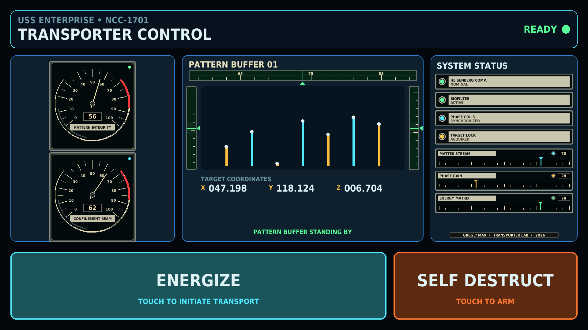

# Raspberry Pi Transporter Console

A full-screen, touch-first sci-fi transporter console built for a Halloween party. It turns a Raspberry Pi, a 1080p touchscreen, and a speaker into an interactive prop with animated gauges, pattern-buffer displays, sound effects, and an intentionally overdramatic self-destruct sequence.

Designed and built by Greg Gorman with Max (OpenAI Codex).



## Features

- Large touchscreen **ENERGIZE** control with animated transporter sequence
- Ten-second synchronized transport cycle with a gentle audio fade at completion
- Protected two-touch **SELF DESTRUCT** control
- Spoken ten-second countdown, siren, explosion, and five-press abort sequence
- Animated meters, indicators, energy bars, coordinates, and pattern-buffer display
- 1960s spacecraft styling with analog instruments and Apollo-inspired moving-tape meters
- Status-aware tape illumination: green when ready, amber while active or armed, and red for danger
- Panel-mounted analog meters with hardware bezels, calibration scales, needles, and jewel lamps
- Bezel-mounted status annunciators with engraved labels and state legends
- Slowly wandering idle instruments and retro edgewise meters instead of modern progress bars
- Broad analog idle sweeps below the red sector, rising toward caution during transport
- Broad, asynchronous tape movement at idle that stabilizes with fast regulator corrections during transport
- Coordinated acquisition, confinement, dematerialization, transfer, and rematerialization phases
- Slowly searching target coordinates that lock solid throughout transport
- Five-second monochrome Sad Mac crash gag after an unaborted core breach
- Animated mushroom-cloud blast synchronized to the spoken kaboom
- Original two-tone retro computer bonk as the Sad Mac appears
- Low-frequency core-breach impact layered beneath the spoken kaboom
- Full-screen pulsing red self-destruct numerals with persistent abort guidance
- Illuminated countdown-screen ABORT control aligned exactly with its live touch target
- **ACOUSTIC FIELD GAIN** touchscreen slider controlling the real PipeWire output from 0–100%
- Persistent **TRANSPORTER / SHIP STATUS / AUTO** three-position selector
- Apollo-style Ship Status dashboard with Pi, network, WeatherFlow UDP, and curated MQTT telemetry
- Separate Environmental Control page for YoLink room sensors and the outside shed contact
- Paginated House Systems page with selected SmartThings groups and Lewisville water data
- Full-screen 1920×1080 kiosk layout that scales to other resolutions
- Optional physical green and red buttons through Raspberry Pi GPIO
- Keyboard test mode and automatic desktop launch

The touchscreen is the primary interface. Physical arcade buttons are optional.

The center-panel **ACOUSTIC FIELD GAIN** control shows `AFG 000` through
`AFG 100`; at zero it reads `AURAL FIELD MUTED`. It controls PipeWire's current
default audio sink with `wpctl`, caps gain at 100%, and relies on WirePlumber's
enabled state restoration to retain the selected level across application and
Raspberry Pi restarts.

At idle, the pattern buffer remains stable and the analog needles drift only slightly, like live electrical instruments. Rapid pattern motion is reserved for an active transport sequence.

## Hardware used

- Raspberry Pi running Raspberry Pi OS
- CAPERAVE 15.6-inch, 1920×1080, 10-point capacitive touchscreen
- HDMI video and USB touch connection
- Powered speaker
- Optional normally-open buttons on GPIO 17 and GPIO 27

Other HDMI/USB touchscreens should work because the UI derives its size from the active display.

## Quick start

Install dependencies:

```bash
sudo apt update
sudo apt install python3-pygame python3-rpi.gpio python3-psutil python3-paho-mqtt
```

The volume control also requires `wpctl`, supplied by the Raspberry Pi OS
`wireplumber` package.

Install `office_telemetry.py` beside `startrek.py`. Ship Status reads only local
data: Pi health, `wlan0` and `eth0`, WeatherFlow UDP broadcasts on port 50222,
and selected MQTT topics from `snoop433.local:1883`. It does not publish MQTT
messages or require cloud credentials.

The WeatherFlow panel includes a rolling five-minute lightning count built from
the station's one-minute `obs_st` intervals, plus the last or recent average
strike distance in miles. `evt_strike` updates distance immediately without
also incrementing the observation count, preventing duplicate strikes.

## Ship Status selector


The Apollo-style, panel-mounted rotary selector is present in the left
instrument rail on both dashboards:

- **TRANSPORTER** keeps the primary control console visible.
- **SHIP STATUS** keeps the read-only telemetry console visible.
- **AUTO** returns to the transporter on activity and enters Ship Status after
  two READY-state idle minutes.

The selected position is stored in `~/.config/startrek-console.json` and
survives application and Raspberry Pi restarts. In AUTO, the first touchscreen
tap on Ship Status wakes the transporter and is consumed; a second tap is
required to activate a control. GPIO buttons remain immediate and active
sequences always override Ship Status.

When **SHIP STATUS** is selected, the large bottom controls switch between the
existing **NETWORK** panel and **ENVIRONMENT**. Environmental Control remains
quiet and displays `NOT CONFIGURED` until its private YoLink configuration is
enabled. It does not add audible alerts or crowd the transporter screen.

## YoLink Environmental Control


The integration uses an ordinary YoLink account UAC and the existing cloud hub;
it does not require a Local Hub. HTTPS provides inventory and reconciliation,
then one read-only MQTT connection receives reports from
`mqtt.api.yosmart.com:8003`. The official documentation describes this as TCP
and does not document a TLS setting for that port, so the implementation does
not silently select an undocumented TLS port. It never publishes or controls a
device.

Copy the example privately on the Pi and protect it before adding credentials:

```bash
install -m 600 startrek-yolink.example.json ~/.config/startrek-yolink.json
```

Create Personal Access Credentials in the YoLink app under **Account → Advanced
Settings → Personal Access Credentials**, then place the UAC client ID and
secret in the private file. Keep `enabled` false until setup is complete. After
enabling it, retrieve a redacted inventory—device names, types, models and IDs,
but never tokens—with:

```bash
python3 yolink_telemetry.py --inventory
```

Put the confirmed outside-shed contact ID in `shed_device_id`. Optional
`name_overrides` and `sensor_order` maps use stable device IDs. Temperature and
door observations are retained locally for seven days by default in
`~/.local/share/startrek-console/yolink-history.db`; credentials and device
tokens are never stored there.

YoLink THSensor API temperatures are normalized from Celsius to Fahrenheit for
the console, including YS8017 reports whose `mode` field describes the device
display preference rather than the numeric API unit. Missing credentials,
cloud loss, disconnected MQTT, unavailable history, individual sensor errors,
and missing reports do not stop the kiosk. A disconnected source qualifies a
door value as `LAST KNOWN` rather than presenting it as safely current.

The local broker at `snoop433.local:1883` remains a separate, read-only sensor
bus. The console subscribes only to its curated display topics and publishes
nothing; raw topic discovery is not exposed on the party UI.

## House Systems and water resources


The **HOUSE SYSTEMS** page groups Greg's selected retained SmartThings topics
into Back Yard, Bar, Breakfast Nook, Couch, Dining Room, Family Room, Fence,
Garage Refrigerator, Hallway, and Patio panels. It extracts only useful status
capabilities such as switch state, dimmer level, audio playback/volume, device
health, temperature, and water state. Old retained values retain their actual
report age instead of being presented as fresh observations. The page is
read-only and paginates six groups at a time.

Water Resources polls the primary USGS feeds directly every 15 minutes in a
background worker, while retaining the existing MQTT topics as fallback:

- Lewisville Lake: site `08052800`, parameter `62614` (reservoir elevation,
  feet above NGVD 1929)
- Elm Fork Trinity River: site `08053000`, parameters `00060` (discharge in
  cubic feet per second) and `00065` (gage height in feet)

The reservoir instrument uses Greg's supplied reference elevations: dead pool
481 ft, normal 522 ft, spillway crest 532 ft, and emergency level 552 ft. These
are labeled reference marks, not invented warning bands. Failed responses are
shown as `DATA LINK FAULT`; a previously valid measurement remains explicitly
qualified as `LAST VALID` rather than being replaced with zero.

Copy `startrek.py`, `office_telemetry.py`, `yolink_telemetry.py`, and your audio
files into one directory, then run:

```bash
python3 startrek.py --test
```

Test controls:

- `G` — energize transporter
- `R` — start self-destruct or add one abort press
- `Q` or `Esc` — exit

For the full Raspberry Pi kiosk with GPIO enabled:

```bash
python3 startrek.py --mode=both
```

For a short AUTO commissioning test, `--office-timeout=5` temporarily reduces
the idle delay without changing the saved selector position. The production
default remains 120 seconds.

## Audio files

Audio recordings are not included. Add your own original, licensed, or public-domain WAV files:

```text
transporter.wav
siren.wav
speak_started.wav
speak_10.wav through speak_1.wav
speak_aborted.wav
speak_kaboom.wav
```

Voice uses mixer channel 0 at full volume. The siren loops on channel 1 at 40% so the countdown stays intelligible. The console still runs when sounds are absent.

The generated Sad Mac chime and core-breach impact play at unity application
gain. Their synthesized sample levels retain digital headroom; system loudness
is controlled by **ACOUSTIC FIELD GAIN**.

For the included ten-second visual cycle, a transporter effect around 10.8 seconds works well: retain ten seconds at full level, then fade over the final 0.8 seconds. Longer replacement sounds are automatically faded by the application when the visual sequence ends.

## Options

```bash
python3 startrek.py --mode=transporter
python3 startrek.py --mode=selfdestruct
python3 startrek.py --mode=both
```

Add `--test` to bypass GPIO. Add `--windowed` for a resizable 1280×720 development window.

## Touch behavior

- **ENERGIZE** starts immediately when ready.
- **SELF DESTRUCT** changes to **CONFIRM**. A second touch within four seconds starts it.
- During the sequence, the same area becomes **ABORT**. Press five times to cancel.
- Touch-generated mouse events are de-duplicated so one tap cannot count twice.

## Optional GPIO buttons

Wire each normally-open button between its GPIO pin and ground. Internal pull-ups are enabled.

| Function | BCM GPIO | Physical pin |
|---|---:|---:|
| Transporter | 17 | 11 |
| Self-destruct / abort | 27 | 13 |
| Ground | — | 6, 9, 14, or another GND |

## Autostart

Edit `startrek.desktop` if your username or path differs, then install it:

```bash
mkdir -p ~/.config/autostart
cp startrek.desktop ~/.config/autostart/
```

The launcher expects `/home/ggorman/startrek.py`. Change both `Exec` and `Path` to install elsewhere.

## Safety and escape hatch

This is a theatrical prop. It does not control real transporters, warp cores, or self-destruct hardware.

Keep SSH available during setup. Press `Q` or `Esc` in test mode, or stop the process remotely when running full-screen.

To shut down without a keyboard, press and hold the small `GREG // MAX` maker plate for five seconds. A protected confirmation screen appears for ten seconds. Touch **SHUT DOWN** to safely power off the Raspberry Pi or **CANCEL** to return to the console. Wait until the display goes dark before removing power.

## License and attribution

The original code is released under the MIT License.

This is an unofficial fan-made project inspired by classic science-fiction control panels. *Star Trek* and related names and marks belong to their respective owners. No affiliation or endorsement is claimed. Audio from the television programs or films is not distributed here.
